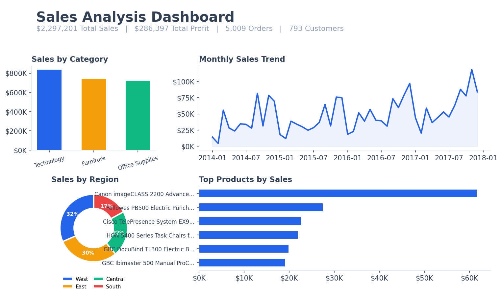
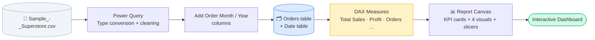
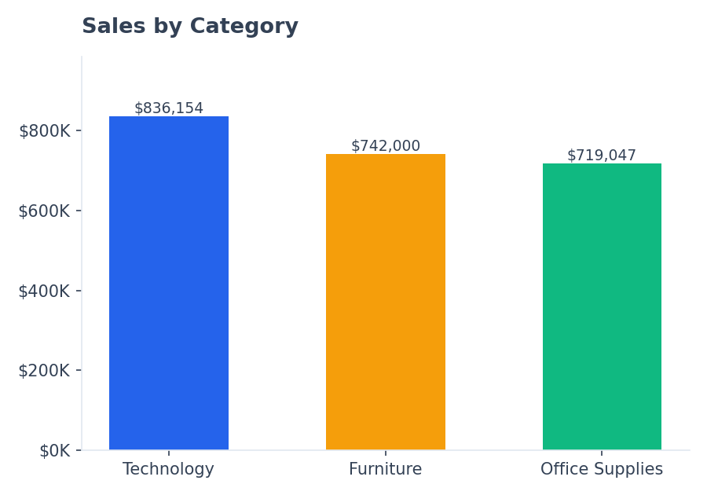
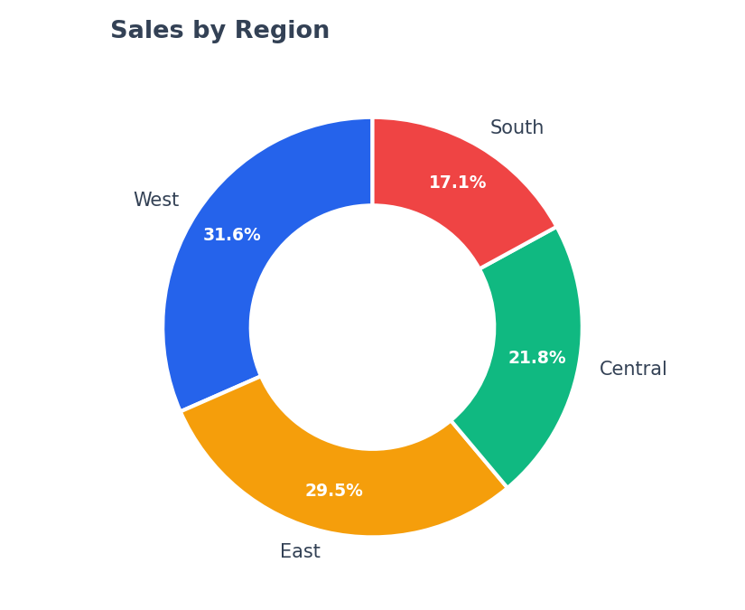
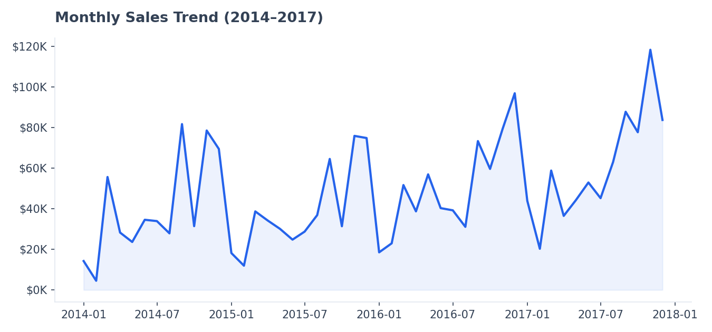
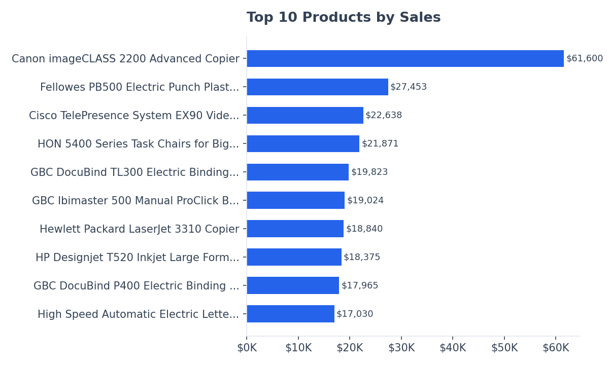

<div align="center">

# 📊 Sales Analysis Dashboard
### Interactive Power BI Business Intelligence Report — Sample Superstore

[](https://powerbi.microsoft.com/)
[](#-dax-measures)
[](#-power-query-m-transformation)

*A single-page, fully interactive sales dashboard built from raw CSV to click-through report — covering 9,994 orders across four years of US retail data.*

</div>

<p align="center">
  
</p>

<div align="center">

**$2,297,200.86** Total Sales &nbsp;·&nbsp; **$286,397.02** Total Profit &nbsp;·&nbsp; **5,009** Orders &nbsp;·&nbsp; **793** Customers

</div>

---

## 📑 Table of Contents

<details open>
<summary>Click to expand / collapse</summary>

- [Overview](#-overview)
- [Dataset](#-dataset)
- [Data Pipeline](#-data-pipeline)
- [Power Query (M) Transformation](#-power-query-m-transformation)
- [DAX Measures](#-dax-measures)
- [Dashboard Visuals](#-dashboard-visuals)
- [Key Insights](#-key-insights)

</details>

---

## 🔎 Overview

This project turns the classic **Sample Superstore** dataset into a decision-ready, single-page Power BI dashboard. It covers the complete BI workflow:

| Stage | Tool | What happens |
|---|---|---|
| **Import & Clean** | Power Query (M) | Type conversion, duplicate check, date-part columns |
| **Model** | Power BI Data Model | Star schema with a marked Date table |
| **Calculate** | DAX | 7 measures — sales, profit, orders, customers, growth |
| **Visualize** | Power BI Report Canvas | KPI cards, trend line, category/region breakdowns, top-products ranking |

Every visual on the page cross-filters the others — select a Region in the slicer and the trend line, category chart, and top-products ranking all update together.

---

## 🗃️ Dataset

<table>
<tr><td><b>Source</b></td><td>Sample Superstore (US retail orders)</td></tr>
<tr><td><b>Rows</b></td><td>9,994</td></tr>
<tr><td><b>Date range</b></td><td>Jan 3, 2014 – Dec 30, 2017 (48 months)</td></tr>
<tr><td><b>Missing values</b></td><td>0</td></tr>
<tr><td><b>Duplicate rows</b></td><td>0</td></tr>
<tr><td><b>Key columns</b></td><td><code>Order ID</code>, <code>Order Date</code>, <code>Customer Name</code>, <code>Product Name</code>, <code>Category</code>, <code>Region</code>, <code>Sales</code>, <code>Profit</code></td></tr>
</table>

---

## 🔄 Data Pipeline



---

## ⚙️ Power Query (M) Transformation

<details>
<summary><b>Show the full M script</b> (also in <a href="Power_Query_M_Script.txt"><code>Power_Query_M_Script.txt</code></a>)</summary>

```m
let
    Source = Csv.Document(
        File.Contents("C:\Path\To\Sample_-_Superstore.csv"),
        [Delimiter=",", Columns=21, Encoding=1252, QuoteStyle=QuoteStyle.Csv]
    ),
    #"Promoted Headers" = Table.PromoteHeaders(Source, [PromoteAllScalars=true]),
    #"Changed Type" = Table.TransformColumnTypes(#"Promoted Headers", {
        {"Order Date", type date}, {"Ship Date", type date},
        {"Sales", type number}, {"Profit", type number},
        {"Discount", type number}, {"Quantity", Int64.Type}
        /* ...remaining columns as text, see full script */
    }),
    #"Removed Duplicates" = Table.Distinct(#"Changed Type", {"Row ID"}),
    #"Added Month Name" = Table.AddColumn(#"Removed Duplicates", "Order Month", each Date.MonthName([Order Date]), type text),
    #"Added Year" = Table.AddColumn(#"Added Month Name", "Order Year", each Date.Year([Order Date]), Int64.Type)
in
    #"Added Year"
```

</details>

**Steps summary:**

1. `Get Data → Text/CSV` → import the file (source encoding `Windows-1252`)
2. `Use First Row as Headers`
3. `Change Type` — dates → Date, Sales/Profit/Discount → Decimal, Quantity → Whole Number
4. `Remove Duplicates` on `Row ID` (verification — dataset already has none)
5. `Add Column` — `Order Month`, `Order Year` for chronological sorting
6. `Close & Apply`

---

## 🧮 DAX Measures

<details>
<summary><b>Show all measures</b> (also in <a href="DAX_Measures.txt"><code>DAX_Measures.txt</code></a>)</summary>

```dax
Total Sales      = SUM(Orders[Sales])
Total Profit     = SUM(Orders[Profit])
Total Orders     = DISTINCTCOUNT(Orders[Order ID])
Total Customers  = DISTINCTCOUNT(Orders[Customer ID])
Average Sales    = DIVIDE([Total Sales], [Total Customers])

Sales Growth =
VAR CurrentSales = [Total Sales]
VAR PrevMonthSales =
    CALCULATE([Total Sales], DATEADD('Date'[Date], -1, MONTH))
RETURN
    DIVIDE(CurrentSales - PrevMonthSales, PrevMonthSales)

Profit Margin    = DIVIDE([Total Profit], [Total Sales])
YTD Sales        = TOTALYTD([Total Sales], 'Date'[Date])
```

</details>

| Measure | Validated Value |
|---|---|
| Total Sales | **$2,297,200.86** |
| Total Profit | **$286,397.02** |
| Total Orders | **5,009** |
| Total Customers | **793** |
| Average Sales / Customer | **$2,896.85** |

---

## 📈 Dashboard Visuals

<table>
<tr>
<td width="50%">

**Sales by Category**


</td>
<td width="50%">

**Sales by Region**


</td>
</tr>
<tr>
<td colspan="2">

**Monthly Sales Trend**


</td>
</tr>
<tr>
<td colspan="2">

**Top 10 Products by Sales**


</td>
</tr>
</table>

---

## 💡 Key Insights

- 🖥️ **Technology** is the top-selling category ($836,154), narrowly ahead of Furniture and Office Supplies.
- 🧭 The **West** region drives the most revenue (32%), while the **South** contributes the least (17%).
- 📅 Sales spike every **November–December**, consistent with holiday-season retail demand — visible as recurring peaks in the trend line.
- 🖨️ High-ticket equipment (copiers, binding systems, videoconferencing units) dominates the **Top 10 products**, a signal that category-level totals alone can hide.
- 👥 With 793 unique customers over 5,009 orders, the average customer places **~6.3 orders**, each averaging **~$459**.

---

</div>
