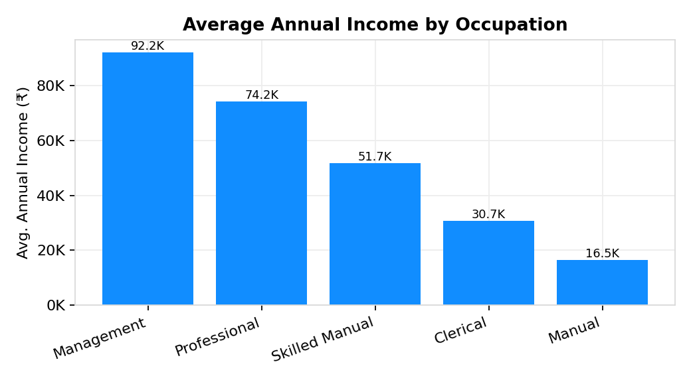
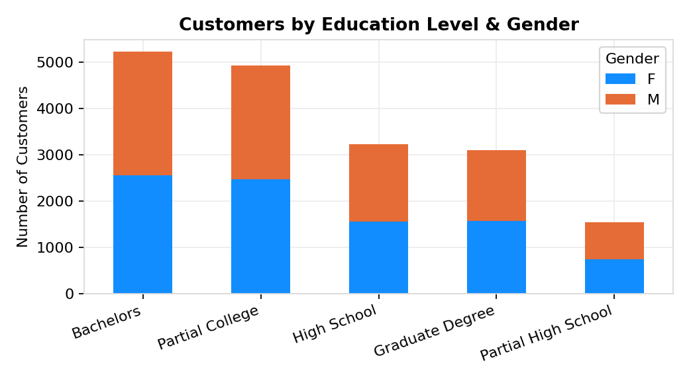
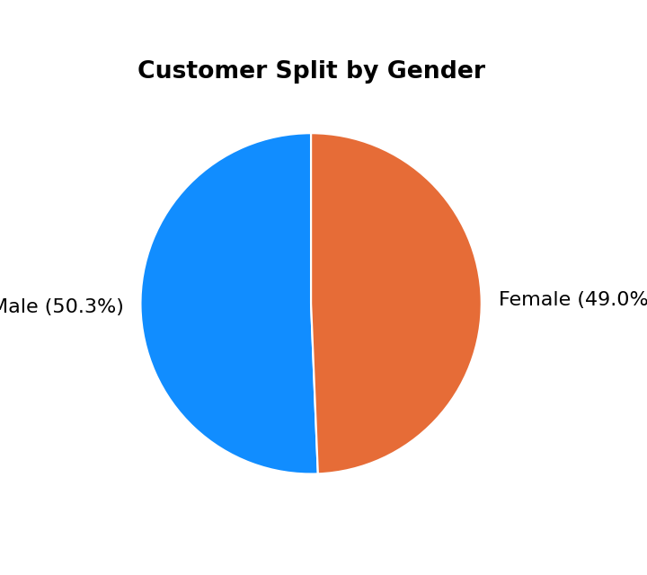
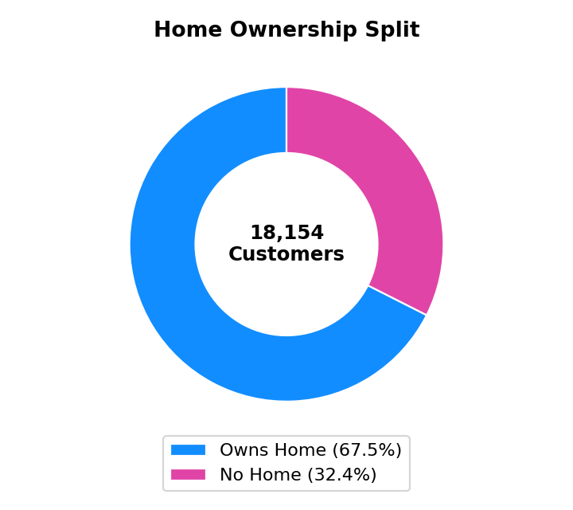
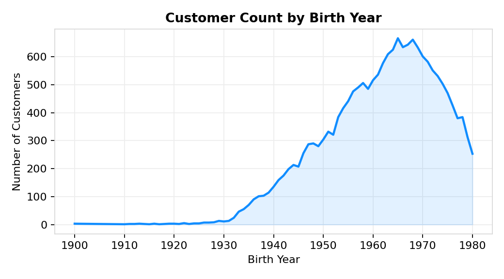
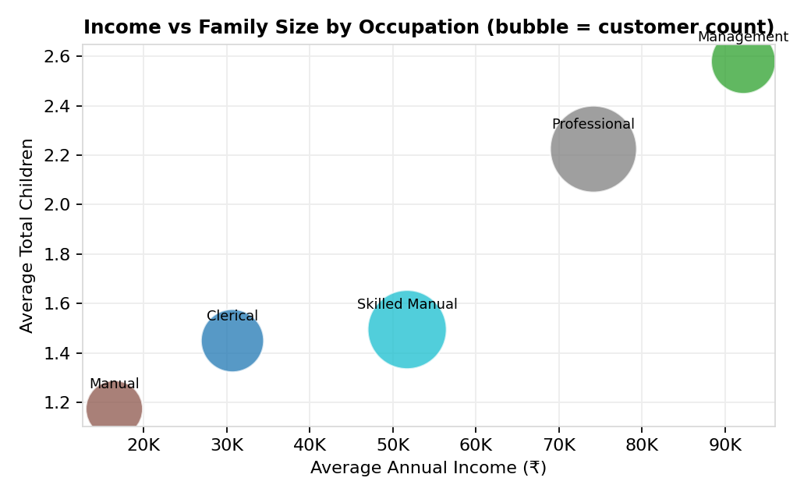
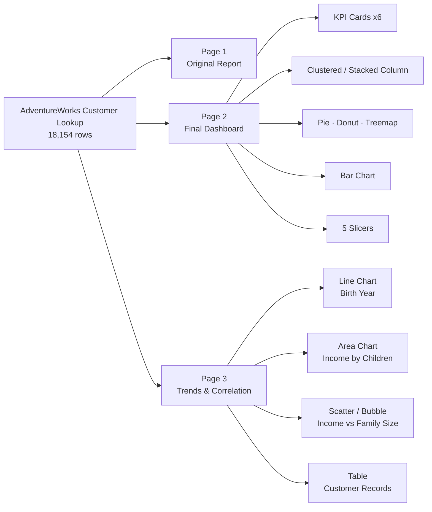

<div align="center">

# 📊 DV Lab 2 — Final Dashboard
### Interactive Power BI Report | Customer Intelligence Dashboard


*Experiment No. 02 — Designing Interactive Reports to Visualise Tabular, Categorical, Trend-based and Geographical Data using Microsoft Power BI Desktop*

</div>

---

## 📌 Overview

This repo holds my Data Visualisation Lab 2 submission — a Power BI report built on top of the **AdventureWorks Customer Lookup** dataset (18,154 customer records). The brief asked for a full interactive dashboard covering tabular, categorical, part-to-whole, trend and correlation visuals, so that's what's here: two new landscape pages added on top of the existing report, wired together with slicers so it's actually explorable and not just a set of static charts.

> **Heads up:** this dataset is customer demographics only — no Sales, Region or Order Date fields exist in the model. So you won't find Map/Geography visuals here; I built strictly from what's actually in the data instead of faking fields that don't exist. More on that below.

---

## 🖼️ Chart Previews

*(These are reference charts generated directly from the underlying data to preview here on GitHub — open the `.pbix` in Power BI Desktop for the real interactive visuals, slicers and cross-filtering.)*

<table>
<tr>
<td width="50%">

**Average Income by Occupation**


</td>
<td width="50%">

**Customers by Education & Gender**


</td>
</tr>
<tr>
<td width="50%">

**Customer Split by Gender**


</td>
<td width="50%">

**Home Ownership Split**


</td>
</tr>
<tr>
<td width="50%">

**Customer Count by Birth Year**


</td>
<td width="50%">

**Income vs. Family Size by Occupation**


</td>
</tr>
</table>

---

## 🗂️ Report Structure



Both new pages are built on a standard **16:9 landscape canvas (1280×720)** — the same as the original Page 1 — so it opens and prints the way a normal dashboard should.

| Page | Contents |
|---|---|
| **Page 1** | Original report (untouched) |
| **Page 2 — Final Dashboard** | 6 KPI cards · Clustered Column · Stacked Column · Pie · Clustered Bar · Donut · Treemap · 5 Slicers |
| **Page 3 — Trends & Correlation** | Line · Area · Scatter/Bubble · Table |

---

## 📁 Dataset

| Field | Type | Description |
|---|---|---|
| `CustomerKey` | Whole Number | Unique customer ID |
| `FirstName` / `LastName` / `Prefix` | Text | Customer name |
| `BirthDate` | Date | Only date field in the model |
| `MaritalStatus` | Text | M / S |
| `Gender` | Text | M / F |
| `AnnualIncome` | Whole Number | Reported annual income |
| `TotalChildren` | Whole Number | Number of children |
| `EducationLevel` | Text | Highest education attained |
| `Occupation` | Text | Job category |
| `HomeOwner` | Text | Y / N |
| `Domain Name` | Text | Derived from e-mail domain (Power Query) |

---

## 🧮 DAX Measures

**Already in the model:**
```dax
Total Customers = COUNTROWS('AdventureWorks Customer Lookup')

Home Owner Rate =
DIVIDE(
    CALCULATE(COUNTROWS('AdventureWorks Customer Lookup'), 'AdventureWorks Customer Lookup'[HomeOwner] = "Y"),
    COUNTROWS('AdventureWorks Customer Lookup')
)
```

**Recommended additions** (paste into Power BI Desktop → Home → New Measure — see the full report for the complete list):
```dax
Average Annual Income = AVERAGE('AdventureWorks Customer Lookup'[AnnualIncome])

Married Rate =
DIVIDE(
    CALCULATE(COUNTROWS('AdventureWorks Customer Lookup'), 'AdventureWorks Customer Lookup'[MaritalStatus] = "M"),
    [Total Customers]
)

Income Rank by Occupation =
RANKX(
    ALL('AdventureWorks Customer Lookup'[Occupation]),
    CALCULATE(AVERAGE('AdventureWorks Customer Lookup'[AnnualIncome])),
    , DESC
)
```

---

## ✨ Interactive Features

- ✅ Cross-filtering / cross-highlighting across every visual on a page
- ✅ 5 slicers — Gender, Occupation, Home Owner, Marital Status, Education Level
- ✅ Drill-enabled date hierarchy (Year → Quarter → Month → Day) on the Line chart
- ✅ Consistent rounded-container styling on the existing report theme

---

## 📈 Key Insights

- **Occupation drives income** — Management (₹92.2K avg) and Professional (₹74.2K avg) earn far more than Manual (₹16.5K avg) — a 5.6× spread.
- **67.5%** of customers own their home; **54.1%** are married.
- Customer births cluster mostly between the **1945–1975** range — the base skews toward middle-aged/older adults.
- **Professional** and **Skilled Manual** are simultaneously the largest occupation segments *and* mid-to-high earners — the best-leverage groups for broad campaigns.
- Gender is close to a 50/50 split and doesn't meaningfully skew any other dimension tested.

---

## 🚀 How to Open

1. Clone / download this repo
2. Open **`DV_Lab_2_Final_Dashboard.pbix`** in Power BI Desktop (2023+ recommended)
3. Go to **Page 2 ("Final Dashboard")** and **Page 3 ("Trends & Correlation")** to see the new work
4. Use the slicers at the bottom of Page 2 to filter the whole page

---

## 🛠️ Tech Stack

`Power BI Desktop` · `DAX` · `Power Query (M)` · `AdventureWorks sample dataset`

---

## 📄 Files in this Repo

```
├── DV_Lab_2_Final_Dashboard.pbix   # Power BI report file
├── DV_Lab_2_Report.docx            # Full lab report (Word)
├── DV_Lab_2_Report.pdf             # Full lab report (PDF)
├── README.md                       # You are here
└── assets/                         # Chart previews used in this README
```

---

## 👤 Author

**[Your Name]** — [Roll No. / PRN] · Data Visualisation Laboratory, AY 2025–26

---

<div align="center">
<sub>Built with Power BI Desktop as part of the Data Visualisation Lab coursework.</sub>
</div>
